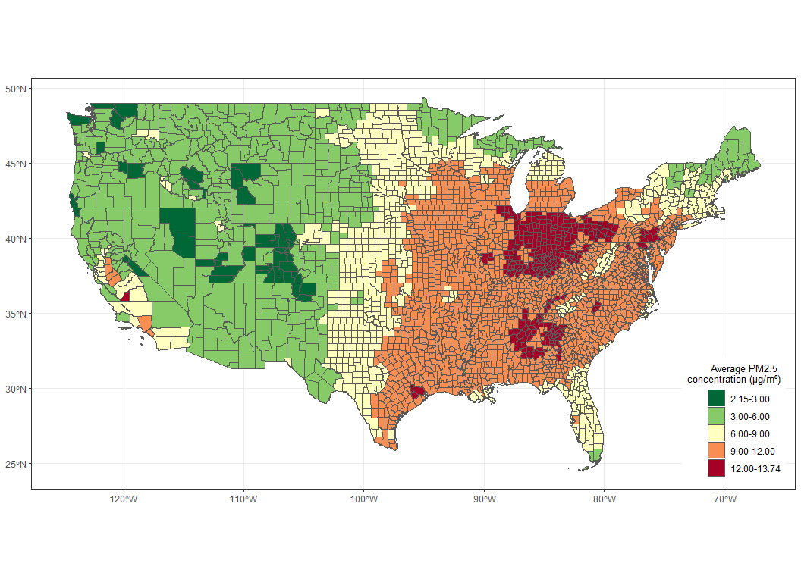
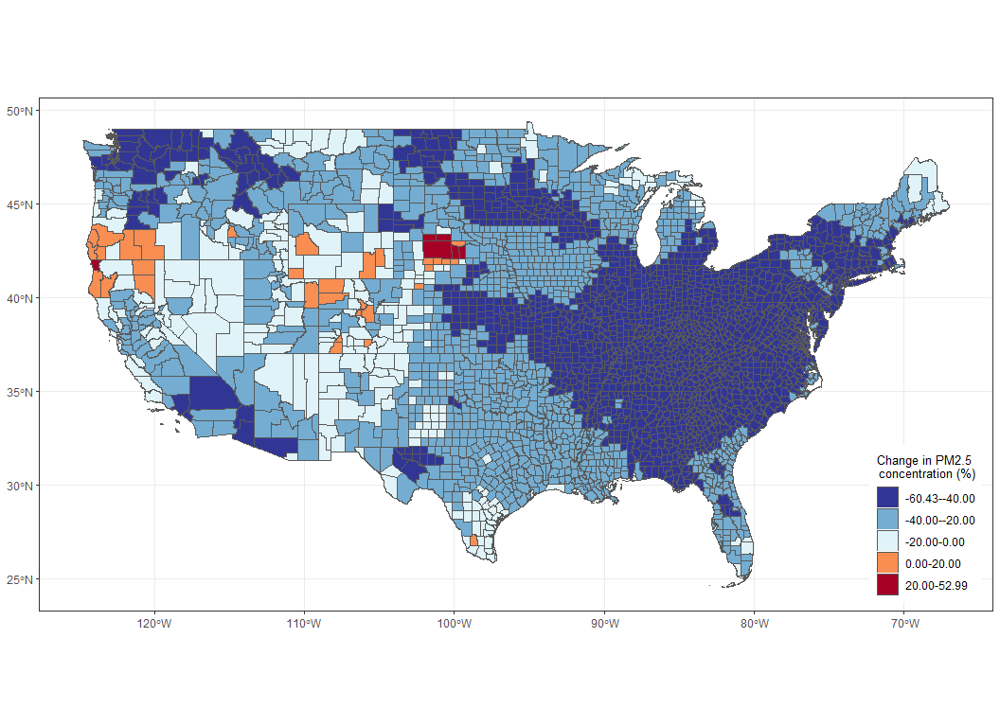

I4R replicationGames (Wellington, NZ)
================
Steph, Sam, Iggy
2025-12-04

## *Replication attempt of (Ma et al., 2023) Racial/ethnic disparities in PM<sub>2.5</sub>-attributable cardiovascular mortality burden in the United States*

<https://www.nature.com/articles/s41562-023-01694-7>

# Details

## Replication attempts

- Figure 1a ➝ `fig_1a_rep` ✓

- Figure 1b ➝ `fig_1b_rep` ✓

- ~~Figure 1c~~ *➝ see attempted section*

- ~~Supplementary Figure 2~~ *➝ see attempted section*

## Repository

**All the data and code from our replication attempt are in the
following GitHub repository:
<a href="https://github.com/samsiljee/PM2.5_CVD_mortality_US"
class="uri"><em>https://github.com/samsiljee/PM2.5_CVD_mortality_US</em></a>**

<span class="smallcaps">*Our replication repository was branched from
the github repository of the original article
(<https://github.com/CHENlab-Yale/PM2.5_CVD_mortality_US>).*</span>

### Code

**Final version** (this present file):
***I4R_replication_code_Ma_et_al_2023_NHB_PM2.5_CVD_mort_US.Rmd***

*Previous version - replicationReportWorking.Rmd*

### Data

All data is contained within the replication repository, including the
data provided by the authors.

- *US_continental_counties_3103.zip*

- *Data_2000-2016_county_monthly_combined.7z*

In addition to the data retrieved from
<https://wonder.cdc.gov/cmf-icd10.html> and generated as a part of the
replication attempt.

- *CompMort_01_08.csv*

- *CompMort_09_16.csv*

- *missing_columns.txt*

------------------------------------------------------------------------

# Setup

### Load Packages

``` r
# Load Packages
library(readr) # read csv file in
library(dplyr) # wrangling
library(tidyr) # Remove NAs in merged data
library(lubridate) # dates 
library(sf) # for reading .shp data | fig1a & 1b
library(tsModel) # for runMean() - e.g. fig 1c
library(ggplot2) # graphing | fig1a & 1b
```

## Prepare Data

``` r
# Set seed for randomisation purposes
set.seed(2025)

# Setup - Load in data file
# set working directory as source file location
# Read in upzipped .csv data from "input" folder within

# Read in .shp US countys geospatial data us sf package
US.county <- st_read("input/US_continental_counties_3103/US_continental_counties_3103.shp") 

# Read in PM2.5 & evironmental data 
df1 <- read_csv("input/Data_2000-2016_county_monthly_combined.csv")


# ~ ~ ~ ~ ~ ~ ~ ~ ~ ~ ~ 
# The data below was not provided with the original article
# retrieved from CDC WONDER in a further replication attempt
# Read in overall mortality data 
df2 <- rbind(
  read_csv("input/CompMort_01_08.csv"),
  read_csv("input/CompMort_09_16.csv")
)

# Merge data 
df3 <- merge(
  mutate(filter(df2, !is.na("Year")), GEOID = `County Code`, year = Year),
  df1,
  by = c("GEOID", "year")
)

# Clean data
df3 <- df3 %>%
  mutate(
    CVD.adj = as.numeric(`Age Adjusted Rate`, na.rm = TRUE),
    GEOID = as.factor(GEOID)
  ) %>% # change column classes
  dplyr::select(
    c(
      GEOID,
      year_month,
      year,
      month,
      PM25,
      NO2,
      O3,
      Tmean,
      dewT,
      pop.total,
      pop.Male,
      pop.Female,
      pop.White,
      pop.Black,
      pop.Hispanic,
      CVD.adj
    )
  ) # Select required columns

# Add in dummy data for columns missing from mortality data
missing_columns <- readLines("input/missing_columns.txt")

# Make dummy data with only positive numbers
dummy_data <- matrix(
  data = abs(rnorm(length(missing_columns) * nrow(df3))),
  nrow = nrow(df3),
  ncol = length(missing_columns)
)

colnames(dummy_data) <- missing_columns

df4 <- bind_cols(
  df3,
  dummy_data
)
```

*Provided data*

``` r
head(US.county)
```

    ## Simple feature collection with 6 features and 12 fields
    ## Geometry type: MULTIPOLYGON
    ## Dimension:     XY
    ## Bounding box:  xmin: -101.6913 ymin: 27.20931 xmax: -93.79455 ymax: 33.37719
    ## Geodetic CRS:  NAD83
    ##   STATEFP COUNTYFP COUNTYNS       AFFGEOID GEOID     NAME LSAD      ALAND
    ## 1      48      081 01383826 0500000US48081 48081     Coke   06 2361153195
    ## 2      48      273 01383922 0500000US48273 48273  Kleberg   06 2282572445
    ## 3      48      203 01383887 0500000US48203 48203 Harrison   06 2331138836
    ## 4      48      223 01383897 0500000US48223 48223  Hopkins   06 1987629163
    ## 5      48      033 01383802 0500000US48033 48033   Borden   06 2324366073
    ## 6      48      419 01383995 0500000US48419 48419   Shelby   06 2060566172
    ##      AWATER  FIPS Shape_Leng Shape_Area                       geometry
    ## 1  42331832 48081   1.956118  0.2290779 MULTIPOLYGON (((-100.825 31...
    ## 2 541041659 48273   3.730682  0.2146460 MULTIPOLYGON (((-97.3178 27...
    ## 3  40651525 48203   2.526008  0.2277106 MULTIPOLYGON (((-94.70215 3...
    ## 4  65639829 48223   2.192214  0.1984369 MULTIPOLYGON (((-95.86333 3...
    ## 5  22297606 48033   1.908255  0.2257665 MULTIPOLYGON (((-101.6913 3...
    ## 6 101081674 48419   2.330799  0.2058710 MULTIPOLYGON (((-94.51143 3...

``` r
head(df1)
```

    ## # A tibble: 6 × 16
    ##    ...1 GEOID year_month  year month  PM25   NO2    O3 Tmean  dewT pop.total
    ##   <dbl> <chr> <chr>      <dbl> <dbl> <dbl> <dbl> <dbl> <dbl> <dbl>     <dbl>
    ## 1     1 01001 2000-01     2000     1  11.3  17.9  31.1  8.98  2.27     44021
    ## 2     2 01001 2000-02     2000     2  15.4  19.5  40.5 11.6   3.41     44021
    ## 3     3 01001 2000-03     2000     3  15.3  17.1  43.7 15.6   7.67     44021
    ## 4     4 01001 2000-04     2000     4  13.2  13.1  46.1 16.1   8.93     44021
    ## 5     5 01001 2000-05     2000     5  18.1  11.4  50.9 23.9  15.5      44021
    ## 6     6 01001 2000-06     2000     6  16.4  11.0  47.8 25.8  17.9      44021
    ## # ℹ 5 more variables: pop.Male <dbl>, pop.Female <dbl>, pop.White <dbl>,
    ## #   pop.Black <dbl>, pop.Hispanic <dbl>

*Additional data*

``` r
head(df2)
```

    ## # A tibble: 6 × 9
    ##   Notes County    `County Code`  Year `Year Code` Deaths Population `Crude Rate`
    ##   <chr> <chr>     <chr>         <dbl>       <dbl> <chr>  <chr>      <chr>       
    ## 1 <NA>  Autauga … 01001          2001        2001 144    44370      324.544     
    ## 2 <NA>  Autauga … 01001          2002        2002 134    45362      295.401     
    ## 3 <NA>  Autauga … 01001          2003        2003 141    46226      305.023     
    ## 4 <NA>  Autauga … 01001          2004        2004 125    47752      261.769     
    ## 5 <NA>  Autauga … 01001          2005        2005 180    49000      367.347     
    ## 6 <NA>  Autauga … 01001          2006        2006 151    50634      298.219     
    ## # ℹ 1 more variable: `Age Adjusted Rate` <chr>

``` r
head(df3)
```

    ##   GEOID year_month year month      PM25       NO2       O3    Tmean      dewT
    ## 1 01001    2001-03 2001     3 10.528826 12.215402 40.25863 11.36533  4.543513
    ## 2 01001    2001-11 2001    11 15.972955 15.992767 39.28605 15.45450  8.504447
    ## 3 01001    2001-04 2001     4 13.629003 10.385891 45.89492 18.48111 11.671234
    ## 4 01001    2001-12 2001    12  9.451214 13.704446 28.85146 11.14169  5.764958
    ## 5 01001    2001-07 2001     7 18.721767  5.803328 46.91426 26.81964 20.698742
    ## 6 01001    2001-05 2001     5 15.168993 10.988677 51.82476 22.14572 14.355264
    ##   pop.total pop.Male pop.Female pop.White pop.Black pop.Hispanic CVD.adj
    ## 1     44889    21813      23076     36028      7688          680 423.515
    ## 2     44889    21813      23076     36028      7688          680 423.515
    ## 3     44889    21813      23076     36028      7688          680 423.515
    ## 4     44889    21813      23076     36028      7688          680 423.515
    ## 5     44889    21813      23076     36028      7688          680 423.515
    ## 6     44889    21813      23076     36028      7688          680 423.515

``` r
head(df4)
```

    ##   GEOID year_month year month      PM25       NO2       O3    Tmean      dewT
    ## 1 01001    2001-03 2001     3 10.528826 12.215402 40.25863 11.36533  4.543513
    ## 2 01001    2001-11 2001    11 15.972955 15.992767 39.28605 15.45450  8.504447
    ## 3 01001    2001-04 2001     4 13.629003 10.385891 45.89492 18.48111 11.671234
    ## 4 01001    2001-12 2001    12  9.451214 13.704446 28.85146 11.14169  5.764958
    ## 5 01001    2001-07 2001     7 18.721767  5.803328 46.91426 26.81964 20.698742
    ## 6 01001    2001-05 2001     5 15.168993 10.988677 51.82476 22.14572 14.355264
    ##   pop.total pop.Male pop.Female pop.White pop.Black pop.Hispanic CVD.adj
    ## 1     44889    21813      23076     36028      7688          680 423.515
    ## 2     44889    21813      23076     36028      7688          680 423.515
    ## 3     44889    21813      23076     36028      7688          680 423.515
    ## 4     44889    21813      23076     36028      7688          680 423.515
    ## 5     44889    21813      23076     36028      7688          680 423.515
    ## 6     44889    21813      23076     36028      7688          680 423.515
    ##     HHD.adj Hypertensive.adj    IHD.adj    MI.adj Stroke.adj CVD.adj.Male
    ## 1 0.6207567        0.3734216 1.11519256 0.3085868 0.10668026    0.2280052
    ## 2 0.0356414        0.1953846 1.33186479 0.3289730 0.89819324    0.7586802
    ## 3 0.7731545        1.8230206 0.35296552 1.3745417 0.76846727    0.5163805
    ## 4 1.2724891        0.7802052 0.08942425 1.1881932 2.76885840    0.7325838
    ## 5 0.3709754        0.4013142 1.73007768 0.6466095 0.59472944    1.6746095
    ## 6 0.1628543        0.3462601 1.00685889 1.2314789 0.08196847    0.2888791
    ##   CVD.adj.Female CVD.adj.White CVD.adj.Black CVD.adj.Hispanic HHD.adj.White
    ## 1      0.9420110     1.4502885     1.6934810       0.11806235   0.009181004
    ## 2      0.2925727     0.2921163     0.2536629       0.26472843   0.606468971
    ## 3      0.4751769     0.9349849     1.0570808       0.29311883   0.361534954
    ## 4      0.2108703     1.2471765     0.3713105       0.46832023   1.937399163
    ## 5      0.2932361     0.6595511     0.2385414       1.03747527   1.767100037
    ## 6      1.1916087     0.2557481     1.2880972       0.06198589   1.291755077
    ##   HHD.adj.Black HHD.adj.Hispanic Hypertensive.adj.White Hypertensive.adj.Black
    ## 1     0.1799157        1.6333402             0.05587423              1.7056537
    ## 2     0.1128973        0.4019190             0.32667579              0.5540964
    ## 3     0.9696683        1.1107961             0.63296062              2.0162151
    ## 4     0.6878031        0.7416058             0.11084840              1.3243008
    ## 5     0.6805287        0.7458720             2.20858750              0.5284015
    ## 6     1.4664435        1.0077788             1.49582126              0.2637007
    ##   Hypertensive.adj.Hispanic IHD.adj.White IHD.adj.Black IHD.adj.Hispanic
    ## 1                0.09871282     1.2043246    2.09858252       2.24670387
    ## 2                0.48778803     0.7242635    0.66097802       0.17870634
    ## 3                0.65437371     0.3399610    0.54693720       0.40356753
    ## 4                0.88376431     0.1110909    0.03744961       0.08886927
    ## 5                0.71714706     0.5469547    0.65424087       0.66974461
    ## 6                0.41939045     0.8627833    0.28411771       0.59048621
    ##   MI.adj.White MI.adj.Black MI.adj.Hispanic Stroke.adj.White Stroke.adj.Black
    ## 1    1.8971952    0.3815180       1.1712288        0.1923930       0.78870937
    ## 2    0.6906619    0.1980052       0.4920459        0.5137048       0.03789151
    ## 3    0.4508841    3.0154925       0.2400677        1.0934887       1.51079984
    ## 4    0.9200320    0.6213067       0.7277595        1.8887127       0.39207491
    ## 5    0.0149283    0.3113712       0.9919479        0.1077655       0.30395277
    ## 6    1.4732647    1.8248377       0.4842788        0.6546151       0.81454533
    ##   Stroke.adj.Hispanic
    ## 1           0.9741228
    ## 2           1.3364749
    ## 3           0.7648698
    ## 4           0.4007149
    ## 5           1.0963943
    ## 6           1.1932593

# Successfully Replicated

This section details the successful replication of Figures 1a & 1b from
the primary article. It uses the `df1` and `US.county` data prepared
above.

## Figure 1ab

#### Figure 1ab (Ma et al’s Code)

``` r
# from 'Figure 1ab.R'
# using packages dplyr & sf

# re assign df1 "Data_2000-2016_county_monthly_combined.csv" to data
data <- df1 # added 

## average PM2.5 (Figure 1a)
PM25.ave <- data %>%
  group_by(GEOID) %>%
  summarise(PM25_mean = mean(PM25))

## PM2.5 change (Figure 1b)
PM25.2000 <- data %>%
  filter(year == 2000) %>%
  group_by(GEOID) %>%
  summarise(PM25_2000 = mean(PM25))

PM25.2016 <- data %>%
  filter(year == 2016) %>%
  group_by(GEOID) %>%
  summarise(PM25_2016 = mean(PM25))

PM25.change <- PM25.2000 %>%
  left_join(PM25.2016, by = c("GEOID")) %>%
  mutate(PM25_chg = (PM25_2016 - PM25_2000) / PM25_2000 * 100) %>%
  dplyr::select(GEOID, PM25_chg)


## join with shapefile
PM25.ave$GEOID <- as.character(PM25.ave$GEOID)
PM25.change$GEOID <- as.character(PM25.change$GEOID)

US.county.F1 <- US.county %>%
  left_join(PM25.ave, by = "GEOID") %>%
  left_join(PM25.change, by = "GEOID")
```

## Figure 1ab (Our code)

This takes the data prepared above & uses a combination of functions
from `dplyr`, `sf`, & `ggplot2` to replicate the figures as an
alternative to the **ArcGIS Pro** software used in the original article.

- *Note: “ArcGIS Pro was used to make the final maps.” (Github \>
  Analysis Description.pdf \> 2.2 Descriptive Maps)*
  - *Attempted to use the sf package to map information instead.*

    - <a href="https://r-spatial.github.io/sf/articles/sf5.html"
      class="uri"><em>https://r-spatial.github.io/sf/articles/sf5.html</em></a>

    - <a href="https://r-spatial.github.io/sf/articles/sf5.html#ggplot2"
      class="uri"><em>https://r-spatial.github.io/sf/articles/sf5.html#ggplot2</em></a>

##### Colors from figures

``` r
# colors were mapped from the original paper using the eyedropper tool 
# Colors used in figure 1a
fig_1a_colors <- c("#006837", "#86CB67", "#FFFFBF", "#F98E52", "#A50026")

# Colors used in figure 1b
fig_1b_colors <- c("#313695", "#74ADD1", "#E0F3F8", "#F98E52", "#A50026")
```

### Figure 1a Replication

``` r
fig_1a_rep <- US.county.F1 %>%
  mutate( # make new column split by thresholds shown in fig1a
    PM25_mean_rank = case_when(
      PM25_mean > 12 ~ "12.00-13.74", 
      PM25_mean > 9 ~ "9.00-12.00",
      PM25_mean > 6 ~ "6.00-9.00",
      PM25_mean > 3 ~ "3.00-6.00",
      PM25_mean <= 3 ~ "2.15-3.00",
      TRUE ~ "F")) %>% # Default case: if none of the above are true
  ggplot() + # plot
  geom_sf(aes(fill = PM25_mean_rank)) +
  scale_fill_manual( # mapping color to rank/thresholds
    name = "Average PM2.5 \nconcentration (\u00B5g/m\u00b3)",
    breaks = c("2.15-3.00",
               "3.00-6.00",
               "6.00-9.00", 
               "9.00-12.00",
               "12.00-13.74"),
    values = c("#006837", 
               "#86CB67",
               "#FFFFBF",
               "#F98E52",
               "#A50026")) +
  theme_bw() +
  theme(
    legend.position = "inside",
    legend.position.inside = c(.92, .17),
    legend.title = element_text(size = 10, hjust = 1),
  )

fig_1a_rep
```

<!-- -->

### Figure 1b Replication

``` r
fig_1b_rep <- US.county.F1 %>%
  mutate( # make new column split by thresholds shown in fig1b
    PM25_chg_rank = case_when(
      PM25_chg > 20 ~ "20.00-52.99",
      PM25_chg > 0 ~ "0.00-20.00",
      PM25_chg > -20 ~ "-20.00-0.00",
      PM25_chg > -40 ~ "-40.00--20.00", 
      PM25_chg <= -40 ~ "-60.43--40.00",
      TRUE ~ "F")) %>% # Default case: if none of the above are true
  ggplot() + # plot
  geom_sf(aes(fill = PM25_chg_rank)) + 
  scale_fill_manual( # mapping color to rank/thresholds
    name = "Change in PM2.5 \nconcentration (%)",
    breaks = c(
      "-60.43--40.00",
      "-40.00--20.00",
      "-20.00-0.00",
      "0.00-20.00",
      "20.00-52.99"),
    values = c(
      "#313695",
      "#74ADD1",
      "#E0F3F8",
      "#F98E52",
      "#A50026")) +
  theme_bw() +
  theme(
    legend.position = "inside",
    legend.position.inside = c(.93, .17),
    legend.title = element_text(size = 10, hjust = 1),
  )

fig_1b_rep
```

<!-- -->

------------------------------------------------------------------------

# Attempted

### Figure 1c (**Ma et al’s Code**)

``` r
# library(dplyr)
# library(ggplot2)
# library(cowplot)
# library(MetBrewer)
# 
# ## filter for cardiovascular mortality data
# mortality.CVD <- mortality %>%
#   filter(ICD.category == "I" & ICD.number >= 0 & ICD.number <= 99.99) %>%
#   dplyr::select(year_month, res_FIPS, race, hispanic) %>%
#   rename(GEOID = res_FIPS) %>%
#   mutate(
#     race_cat = case_when(
#       race == 1 & hispanic == 0 ~ "non-Hispanic White",
#       race == 2 & hispanic == 0 ~ "non-Hispanic Black",
#       hispanic == 1 ~ "Hispanic"
#     ),
#     race_cat = factor(race_cat, levels = c("non-Hispanic White", "non-Hispanic Black", "Hispanic"))
#   ) %>%
#   dplyr::select(GEOID, year_month, race_cat) %>%
#   filter(is.na(race_cat) == F)
# 
# rm(mortality)
# 
# 
# ## select PM2.5 data
# data.AP <- data %>%
#   dplyr::select(GEOID, year_month, year, PM25)
# 
# ## 12-month moving average of PM2.5 concentration
# data.list <- split(data.AP, as.factor(data$GEOID))
# for (j in 1:length(data.list)) {
#   data.list[[j]][, paste0("PM25_lag0", 11)] <- tsModel::runMean(data.list[[j]]$PM25, c(0:11))
# }
# 
# data.AP.01to16 <- bind_rows(data.list) %>%
#   filter(year >= 2001) %>%
#   dplyr::select(-PM25, -year)
# 
# 
# ## individual-level long-term PM2.5 exposure
# AP.individual <- mortality.CVD %>%
#   left_join(data.AP, by = c("GEOID", "year_month")) %>%
#   left_join(data.AP.01to16, by = c("GEOID", "year_month"))
# 
# ## make the violin plot
# theme_set(theme_cowplot())
# 
# plot.individual.12M <- ggplot(AP.individual, aes(x = race_cat, y = PM25_lag011, fill = race_cat)) +
#   geom_violin() +
#   scale_fill_met_d("Kandinsky", direction = 1) +
#   geom_boxplot(width = 0.1, color = "grey", alpha = 0.2) +
#   xlab("") +
#   ylab("12-month moving average of PM2.5") +
#   theme(legend.position = "none")
```

### Figure 1c ()

``` r
# mortality.CVD_df4 <- df4 %>%


# Taken directly from their code
## select PM2.5 data
data.AP <- data %>%
  dplyr::select(GEOID, year_month, year, PM25)

## 12-month moving average of PM2.5 concentration
data.list <- split(data.AP, as.factor(data$GEOID))
for (j in 1:length(data.list)) {
  data.list[[j]][, paste0("PM25_lag0", 11)] <- tsModel::runMean(data.list[[j]]$PM25, c(0:11))
}

data.AP.01to16 <- bind_rows(data.list) %>%
  filter(year >= 2001) %>%
  dplyr::select(-PM25, -year)
```

## Supplementary Figure 2 (our code)

The reproduced figures are generally similar to the original paper;
however, the data retrieved from CDC WONDER was a simplified set, so the
figures appear less granular.

``` r
# Cut off at <5000
sfig_2 <- df4 %>%
  filter(pop.total < 5000) %>%
  mutate(year_month = lubridate::ym(year_month)) %>% 
  group_by(year_month) %>%
  mutate(monthly_mean_CVD.adj = mean(CVD.adj, na.rm = TRUE)) %>%
  ggplot(aes(x = year_month, y = monthly_mean_CVD.adj)) +
  geom_line() +
  scale_x_date(date_labels = "%Y-%m", date_breaks = "6 month",
               labels = ) +
  labs(title = "Supplementary Figure 2 (pop <5000)") +
  #geom_smooth(method=lm , color="red", fill="#69b3a2", se=TRUE) 
  theme_bw() +
  theme(
    axis.text.x = element_text(angle = 90, vjust = 0.5), # vertical x labels
        )
  
sfig_2
```

<!-- -->

``` r
# Cut off at <50000
sfig_2.v2 <- df4 %>%
  filter(pop.total < 50000) %>%
  mutate(year_month = lubridate::ym(year_month)) %>% 
  group_by(year_month) %>%
  mutate(monthly_mean_CVD.adj = mean(CVD.adj, na.rm = TRUE)) %>%
  ggplot(aes(x = year_month, y = monthly_mean_CVD.adj)) +
  geom_line() +
  scale_x_date(date_labels = "%Y-%m", date_breaks = "6 month",
               labels = ) +
  labs(title = "Supplementary Figure 2 v2 (pop <50000)") +
  #geom_smooth(method=lm , color="red", fill="#69b3a2", se=TRUE) 
  theme_bw() +
  theme(
    axis.text.x = element_text(angle = 90, vjust = 0.5), # vertical x labels
        )
  
sfig_2.v2
```

<!-- -->

------------------------------------------------------------------------

``` r
# end - write out package versions for .html or .md knitted files
sessionInfo()
```

    ## R version 4.4.1 (2024-06-14 ucrt)
    ## Platform: x86_64-w64-mingw32/x64
    ## Running under: Windows 10 x64 (build 19045)
    ## 
    ## Matrix products: default
    ## 
    ## 
    ## locale:
    ## [1] LC_COLLATE=English_New Zealand.utf8  LC_CTYPE=English_New Zealand.utf8   
    ## [3] LC_MONETARY=English_New Zealand.utf8 LC_NUMERIC=C                        
    ## [5] LC_TIME=English_New Zealand.utf8    
    ## 
    ## time zone: Pacific/Auckland
    ## tzcode source: internal
    ## 
    ## attached base packages:
    ## [1] stats     graphics  grDevices utils     datasets  methods   base     
    ## 
    ## other attached packages:
    ## [1] ggplot2_4.0.1   tsModel_0.6-2   sf_1.0-23       lubridate_1.9.4
    ## [5] tidyr_1.3.1     dplyr_1.1.4     readr_2.1.6    
    ## 
    ## loaded via a namespace (and not attached):
    ##  [1] utf8_1.2.4         generics_0.1.4     class_7.3-22       KernSmooth_2.23-24
    ##  [5] hms_1.1.4          digest_0.6.37      magrittr_2.0.3     evaluate_1.0.5    
    ##  [9] grid_4.4.1         timechange_0.3.0   RColorBrewer_1.1-3 fastmap_1.2.0     
    ## [13] e1071_1.7-16       DBI_1.2.3          purrr_1.0.2        scales_1.4.0      
    ## [17] cli_3.6.3          rlang_1.1.4        crayon_1.5.3       units_1.0-0       
    ## [21] bit64_4.6.0-1      splines_4.4.1      withr_3.0.2        yaml_2.3.10       
    ## [25] tools_4.4.1        parallel_4.4.1     tzdb_0.5.0         vctrs_0.6.5       
    ## [29] R6_2.6.1           proxy_0.4-27       lifecycle_1.0.4    classInt_0.4-11   
    ## [33] bit_4.6.0          vroom_1.6.6        pkgconfig_2.0.3    pillar_1.11.1     
    ## [37] gtable_0.3.6       glue_1.8.0         Rcpp_1.1.0         xfun_0.54         
    ## [41] tibble_3.2.1       tidyselect_1.2.1   rstudioapi_0.17.1  knitr_1.50        
    ## [45] farver_2.1.2       htmltools_0.5.8.1  labeling_0.4.3     rmarkdown_2.30    
    ## [49] compiler_4.4.1     S7_0.2.1
